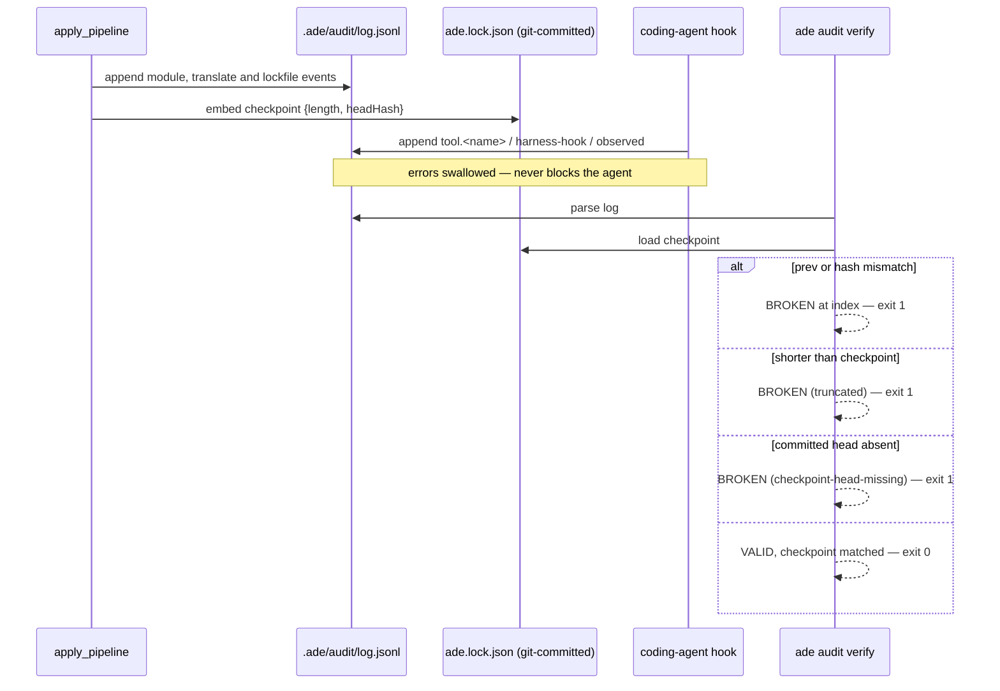

# The tamper-evident audit chain

`.ade/audit/log.jsonl` is a hash chain. Each entry's hash covers the previous hash plus
a canonical serialization of the entry's own fields, with a **fixed key order** enforced
by a dedicated struct so the hash is reproducible across languages. Byte-level parity
with the TypeScript oracle is pinned by hard-coded expected hashes and an exact captured
JSONL line.

The chain is anchored at the public constant `ade-genesis-v1`. That constant being
public is exactly why internal consistency alone is insufficient.

## What the chain alone catches, and what it misses

Verified without a checkpoint, the chain detects only **in-place** tampering: a
`prev-mismatch` when an entry is deleted or reordered, and a `hash-mismatch` when a
field is modified, each reporting the breaking index.

It does not catch truncation, tail-drops, or a chain **re-forged from genesis** — an
attacker who rebuilds the whole log as a self-consistent story passes this check. The
tests assert exactly that before showing the checkpoint catching it.

## The checkpoint lives outside the log

`AuditCheckpoint` records length and head hash, and it lives in the **git-committed
lockfile**, outside the log it protects. That placement is the whole design. Its
semantics are growth-permitting: the chain may only get longer, and the committed head
must still be present.

The documented residual limit is stated in the README rather than hidden: in-place
edits, truncation, tail-drops and re-forged chains are all detected, but an attacker who
rewrites the log **and** the committed lockfile together can still tell a consistent
story. The chain is unsigned; the lockfile is the only external commitment. External
anchoring is named as future work, not claimed as present.

## The hook path is designed to be unfailable

When a coding agent fires its post-tool hook, `hook_append` extends the same chain.
Malformed input, non-object payloads, and I/O errors are all swallowed, because the hook
must never block the agent. Entries have a fixed shape: actor `harness-hook`, action
`tool.<name>`, result `observed`, and a target that is the tool input serialized,
redacted, and capped at 120 characters.

Two honest limits of that redaction: it is heuristic — any run of twenty or more
alphanumeric characters is replaced — so a **short secret survives** and a long benign
identifier is redacted. And because hook failures are invisible by design, a repository
whose `.ade/` is read-only records nothing with no error surfaced.

There is also **no locking** around appends. Two hooks firing simultaneously read the
same tail, and the second write clobbers the first's entry. Not defended against.

## An asymmetry to know when debugging

The observability module's own `verify` checks the chain **without** a checkpoint, while
the full [verify pipeline](pipeline.md) and `ade audit verify` both pass the lockfile's.
The module-level check alone would accept a truncated chain. If you are testing tamper
detection, make sure you are exercising the path that carries the checkpoint.

`ade audit verify` says so when it has no checkpoint to use: the human-readable line
reads `NO lockfile checkpoint` and the JSON payload carries a false flag.

## Source map and tests

`crates/ade-core/src/{audit,hook}.rs`, `crates/ade-core/src/modules/observability.rs`,
and the audit arm of `crates/ade/src/main.rs`. The tests read as a threat model:
`modifying_a_historical_entry_breaks_the_chain_at_that_index`,
`deleting_a_mid_chain_entry_breaks_the_chain`,
`truncating_the_log_to_empty_fails_against_the_checkpoint`,
`dropping_tail_entries_fails_verification`,
`a_chain_reforged_from_the_public_genesis_anchor_is_rejected_by_the_checkpoint`,
`hashes_and_serialized_lines_match_the_ts_oracle_byte_for_byte`, and
`safe_target_redacts_and_caps`.
