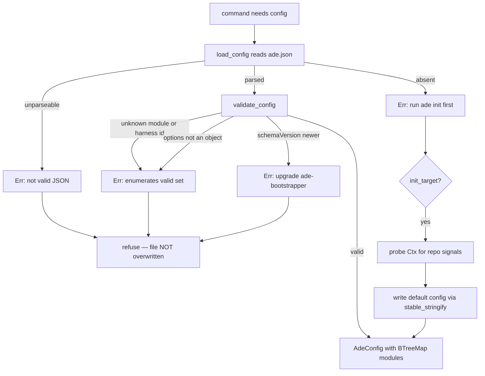

# Configuration and the module contract surface

`ade.json` is the only file a user edits to change what ADE does. It is validated
exactly once, in `crates/ade-core/src/config.rs`, and modules never re-validate it.
The error strings are deliberately identical to those of the v0.1 TypeScript
implementation, because those two implementations are held to byte parity — see
[dual implementation and parity](../verification/dual-implementation-and-parity.md).

## Secure by default, closed by design

The default configuration inserts every known module id with `enabled: true` and empty
options. Bootstrapping opts you into everything; disabling is a deliberate act.

Module ids and harness ids form a **closed vocabulary**. An unknown id is a hard error
whose message enumerates the valid set. This is why adding a module or a coding-agent
target requires a code change rather than a configuration entry, and it is the reason
`registry.rs` and the adapter table are the real extension seams.

A `schemaVersion` greater than the compiled `ADE_SCHEMA_VERSION` is refused outright
with upgrade guidance, rather than best-effort parsed. A newer ADE may write a config
this binary would misinterpret, and misinterpreting a security policy silently is the
failure mode worth spending an error message on.

## The one deliberately loose edge

`modules.<id>.options` is validated only as *object or absent*. Anything object-shaped
passes. A misspelled option key is therefore accepted and silently ignored by whichever
module reads it — per-module option schemas are the module's business, not the core's.
If a module option appears to have no effect, check the spelling before checking the
module.

## Determinism is a type choice, not a serializer flag

`AdeConfig.modules` is a `BTreeMap`, so serialized module order is lexical and stable
regardless of the order keys appear in the file on disk. The same choice is repeated in
the lockfile's `files` and `environment.tools` maps. Serialization then goes through
`stable_stringify` rather than serde's pretty printer, so the bytes match the oracle's
`JSON.stringify` output exactly. [Determinism and I/O](determinism-and-io.md) explains
why that function is hand-rolled.

## What a module receives

`Ctx` is the whole environment snapshot handed to every module: detected tools, the
repository's coding-agent signals, git-ness, os and arch, a frozen copy of the process
environment, and injected `exec` and `which` closures. A module is therefore a pure
function of `Ctx`, which is what makes any machine simulable in a test.

Two details in `types.rs` carry real weight:

- **`ArtifactWriter` is the lockfile-membership mechanism.** Every write records its
  repo-relative path in a mutex-guarded set, so what ADE owns is derived from writes
  actually performed rather than declared in a manifest.
- **Subprocess execution is typed as an argv array**, never a command string, which
  makes shell injection unrepresentable at the contract level rather than merely
  discouraged.

`ctx.module_options(id)` returns an empty object for an unconfigured module, so module
code never has to handle a not-configured case.

## The severity ladder

`Finding` carries five levels, and the distinction between `Degraded` and `Error` is
load-bearing: only `Error` fails verify, while `Degraded` drives the degraded status
row you see when a module applied but its underlying tool is absent. A module reporting
`Degraded` is working as designed on an incompletely equipped machine.

## Source map and tests

`crates/ade-core/src/config.rs` and `crates/ade-core/src/types.rs`. Focused tests, all
in-file: `rejects_bad_shapes_with_oracle_messages` asserts the exact string for every
rejection path, `default_config_enables_everything`,
`serialization_is_sorted_and_stable`, `load_config_reports_missing_and_invalid_files`,
and `fifteen_modules_in_canonical_order` in `registry.rs`. From the shipped binary,
`commands_without_config_exit_1_with_init_guidance` in `crates/ade/tests/cli.rs`.
