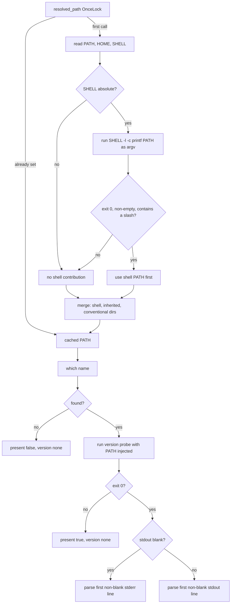

# Detection and the environment layer

Four small files decide what ADE believes about the machine it is running on:
`envpath.rs` resolves `PATH`, `exec.rs` runs subprocesses, `context.rs` probes tools and
coding agents, and `report.rs` turns the result into the rows both the CLI and the
desktop apps display.

## The defect this layer exists to fix

A process launched from Finder, the Dock, or launchd inherits only
`/usr/bin:/bin:/usr/sbin:/sbin`. A detector that trusts the inherited `PATH` therefore
reported a fully equipped developer machine as empty. The module header describes the
result plainly: every row "not installed", every capability a gap, a screen full of
alarm that was entirely false.

The fix lives in the core rather than in a launchd plist, because the CLI and the apps
must agree. `effective_path` merges three sources in a fixed precedence — the login
shell's `PATH`, then the inherited `PATH`, then conventional install directories —
deduplicating while preserving order. The shell wins because it is what the owner would
get in a terminal.

The login-shell probe is hardened three ways: the command is a constant with no
interpolation, it runs as an argv array, and a `SHELL` value that is not an absolute
path is **never executed**, so a relative `SHELL` cannot resolve against the current
working directory. A probe that fails, returns nothing, or returns something without a
slash yields `None` rather than poisoning `PATH`.

The resolved value is computed once into a `OnceLock`, because a `which` probe runs
roughly every four seconds in the desktop app and spawning a login shell per lookup
would be absurd. The consequence is worth knowing: **a `PATH` change mid-process is
never picked up**, so a tool installed while the Control Center is open stays invisible
until restart.

## Finding a tool and running it must agree

`real_exec` injects the resolved `PATH` into every child process. Finding `brew` and
then failing to run it is worse than not finding it. Exactly one call is exempt — the
login-shell probe itself, detected by `is_shell_probe` — because feeding the shell the
`PATH` we are asking it about would be circular.

Execution never panics. Empty argv and spawn failure both return exit code 127 with the
error on stderr, matching the oracle.

## Presence and version are independent facts

Tool detection is two-phase: `which` for presence, then a version probe. A tool found
on `PATH` whose version probe exits nonzero is reported **present with no version** —
a real state, not an error. When stdout is blank the probe falls back to stderr,
because some tools print `--version` there.

Two harness-detection functions mean different things and must not be conflated.
`detect_repo_harnesses` tests configuration signal paths on disk, so a bare empty
`.claude/` directory counts. `detect_machine_harnesses` tests whether any of the
adapter's CLI names is on `PATH`. The first answers "is this repository set up for that
agent", the second "is that agent installed here".

Git detection requires both a zero exit **and** stdout exactly `true`, so a `git`
invocation that succeeds outside a work tree is correctly read as not a repository.

`os` and `arch` are translated to Node-style names (`macos` becomes `darwin`,
`aarch64` becomes `arm64`) so generated artifacts stay byte-compatible with the
TypeScript oracle. That is a determinism requirement, not cosmetics.

## One report, three surfaces

`doctor_report` and `status_report` are the single code path shared by the CLI and both
desktop apps. This is why `ade doctor` and the Control Center cannot disagree about
machine state. `status_report` collapses each module's verify result into one of four
states — `disabled`, `not-applied`, `degraded`, `applied` — and always emits all fifteen
rows, unlike [the verify pipeline](pipeline.md), which omits disabled modules.

## Source map and tests

`crates/ade-core/src/{envpath,exec,context,report}.rs`. The most valuable test
reproduces the original defect directly:
`a_minimal_launch_environment_still_finds_developer_tools` builds the exact Finder
`PATH` and asserts tools are still found. Also
`the_login_shell_is_consulted_safely_or_not_at_all` (relative `SHELL`, failing shell,
non-path output), `a_child_process_inherits_the_resolved_path_not_the_launch_path`
(a real subprocess), `detect_tool_absent_present_and_probe_failure`,
`git_detection_requires_true_stdout`, and
`doctor_reports_every_integrated_tool_and_the_7_supported_harnesses`.
