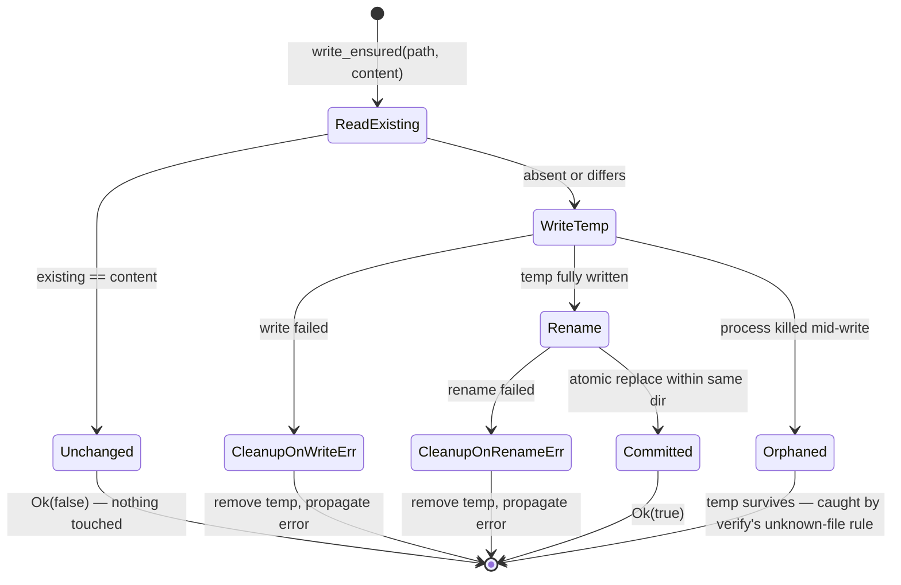

# Determinism and atomic I/O

`crates/ade-core/src/fsutil.rs` is small and unglamorous and almost everything else in
the engine rests on it. Four guarantees live here: byte-stable serialization, atomic
writes, additive line insertion, and the merge/un-merge pair that makes co-owned files
withdrawable.

## Why serialization is hand-rolled

`stable_stringify` sorts keys and emits layout itself rather than relying on
serde_json's map ordering. The reason is stated in the module header: enabling the
`preserve_order` feature *anywhere in the workspace* would silently change key order
and break determinism everywhere. Hand-rolling removes that action at a distance. Only
leaf scalars are delegated to serde_json, so escaping matches JavaScript's exactly.

The contract is byte-level: keys recursively sorted, two-space indent, `": "` between
key and value, `[]` and `{}` for empties, and a trailing newline. That is precisely the
oracle's `JSON.stringify(sortValue(v), null, 2) + "\n"`. The stated scope of the parity
guarantee is the value domain ADE actually uses — ASCII keys, integers, short floats —
not the whole of JSON.

A second, compact sorted form exists as a **separate function rather than a flag**,
used only where a value needs a stable *signature* instead of a stable *file*: audit
entry hashing, and the deduplication sets inside merge and subtraction.

## Every artifact write is a rename

`write_ensured` first compares content. If the bytes already match it returns `false`
and touches nothing — and that boolean is how "changed" propagates up the pipeline
without a second read.

When bytes differ, it writes a sibling temp file and renames it over the target. The
doc comment records the incident behind this: a plain write truncates first, so a crash
or a reader arriving mid-write sees an **empty or partial file** where valid JSON is
expected, and `ade apply` writes dozens of files. The temp name combines process id
with a process-global atomic counter, and it is created in the same directory as its
target, because rename is only atomic within one filesystem.

One failure mode is accepted rather than solved: a temp file surviving a hard kill.
That is deliberate, because [verify](lockfile-and-verify.md)'s unknown-file rule will
flag any unexpected entry under `.ade/` — a far better failure than silent truncation.

**The guarantee is not universal.** `audit::append_events` rewrites the whole log with
a bare `fs::write`, so the append-only audit log does not get the protection the
generated artifacts get. Worth knowing before trusting the log across a crash.

## Additive by construction

`ensure_lines` never reorders or removes user content. It appends only missing lines
under a labelled comment header, and inserts a separating newline when the existing
file lacks a trailing one. Three different modules append three labelled blocks to
`.gitignore` this way.

## The merge and un-merge pair

`deep_merge` folds ADE's patch into a user's JSON: objects recurse, arrays union with
signature-based deduplication, and a scalar from the patch wins. The array
deduplication is what makes re-applying the same patch idempotent, which is why a
second `ade apply` produces a byte-identical `.claude/settings.json`.

`subtract_json` is its inverse, and it is the reason withdrawal is possible at all.
ADE's additions to a co-owned file are unmarked — there is no comment saying "ADE put
this here" — so the only honest withdrawal is subtracting exactly the values ADE would
have written. Subtraction is deliberately conservative in three ways: a value the user
*changed* is left alone because it is theirs now, user array elements survive even when
identical to something elsewhere, and containers the patch created are pruned only when
recursion empties them. The design accepts over-preservation over over-deletion.

`sha256_hex` is specified to match Bun's `CryptoHasher` output, because content hashes
must agree across the Rust and TypeScript implementations. It is a cross-implementation
contract, not an internal helper.

## Source map and tests

All in `crates/ade-core/src/fsutil.rs`. The strongest test is
`write_ensured_is_atomic_under_concurrent_readers`, which runs a reader thread against
sixty alternating large and small writes and asserts zero torn reads and zero surviving
temp files. Also `stable_stringify_matches_js_json_stringify_layout` (expected strings
captured from the oracle), `compact_signature_matches_js`, `sha256_matches_known_vectors`,
`ensure_lines_appends_only_missing_under_label`, `deep_merge_semantics_match_oracle`, and
`subtract_json_is_the_inverse_of_deep_merge_and_spares_user_content`.
