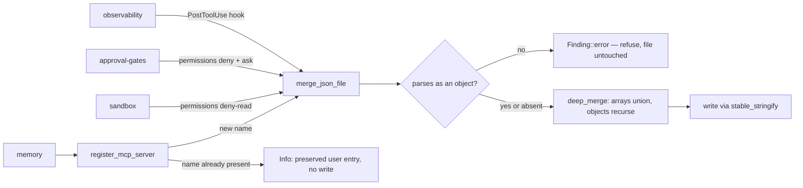

# Coding-agent integration

Seven coding agents are declared as a `const` array in
`crates/ade-core/src/harness/adapters.rs`. There is no dynamic registration seam. Each
adapter carries an instruction-file path, CLI names, configuration-detection signals,
and three capability flags.

## Not every agent can enforce anything

The capability flags are the enforcement boundary, and the asymmetry is the single most
important fact on this page:

- Only **claude-code** has `hooks: true`.
- Only **claude-code** and **opencode** have `permissions: true`.
- The remaining agents receive instruction text and `.ade/policy/*.json` files only.

So a repository configured for, say, Pi or Hermes gets ADE's *guidance* but not ADE's
*enforcement*. That is not a gap in the adapters; it is a property of what those agents
expose. Reading a policy file is advisory; a denied permission is not.

Five agents share `AGENTS.md`, which is why
[translation](instructions-and-managed-blocks.md) deduplicates targets by path.

## One merge function, one refusal contract

Every Claude-side JSON mutation — permissions, MCP registration, hook wiring — goes
through `merge_json_file`. It reads the file, refuses non-objects and unparseable JSON
with **distinct** messages, deep-merges, and writes through `stable_stringify`. Because
all three surfaces share it, they share one refusal contract and one determinism
guarantee.

The merge is strictly additive for containers: arrays union with signature-based
deduplication, objects recurse. A user's pre-existing array entry is never dropped.
Scalars are the one exception — an ADE patch scalar overwrites a user scalar at the same
key.

MCP registration does not rely on the merge to win a collision. It checks for a
same-named server **first** and returns an informational finding preserving the user's
entry.

Hook wiring is expressed purely as a settings patch, so idempotency falls out of array
deduplication for free: a second `ade apply` produces a byte-identical file.

## The hook is a shell script wearing a TypeScript name

The shipped artifact keeps the oracle's `.ade/hooks/audit-log.ts` path, but its content
is POSIX `sh` that executes `ade hook append`. When `ade` is not on `PATH` it drains
stdin and exits zero. The hook is designed never to block the coding agent, which has a
consequence worth stating plainly: **a repository bootstrapped on a machine without
`ade` on `PATH` silently records nothing**, with no error surfaced at hook time.

The wired command is `sh .ade/hooks/audit-log.ts`, a constant the
[removal path](removal.md) also depends on.

## Degraded, not failed

A refused merge downgrades the module to `Degraded` rather than `Failed`, and drops the
settings path from its written paths. A broken user settings file degrades the
bootstrap instead of aborting it.

The OpenMemory MCP server is **opt-in**. Without the explicit option, `.mcp.json` is
never created or touched, and an informational finding names the activation step.
Credential-bearing integrations are not registered by default.

## Source map and tests

`crates/ade-core/src/harness/{adapters,claude}.rs`. Focused tests, all in-file:
`only_claude_code_has_hooks_and_permissions`,
`cursor_gets_mdc_frontmatter_others_do_not`,
`permission_patch_merges_additively_preserving_user_entries`,
`unparseable_settings_json_is_refused_never_clobbered`,
`non_object_settings_json_is_refused_never_clobbered`,
`mcp_registration_preserves_preexisting_user_server_of_same_name`, and
`ade_hook_script_is_posix_sh_delegating_to_ade_with_graceful_noop`.
