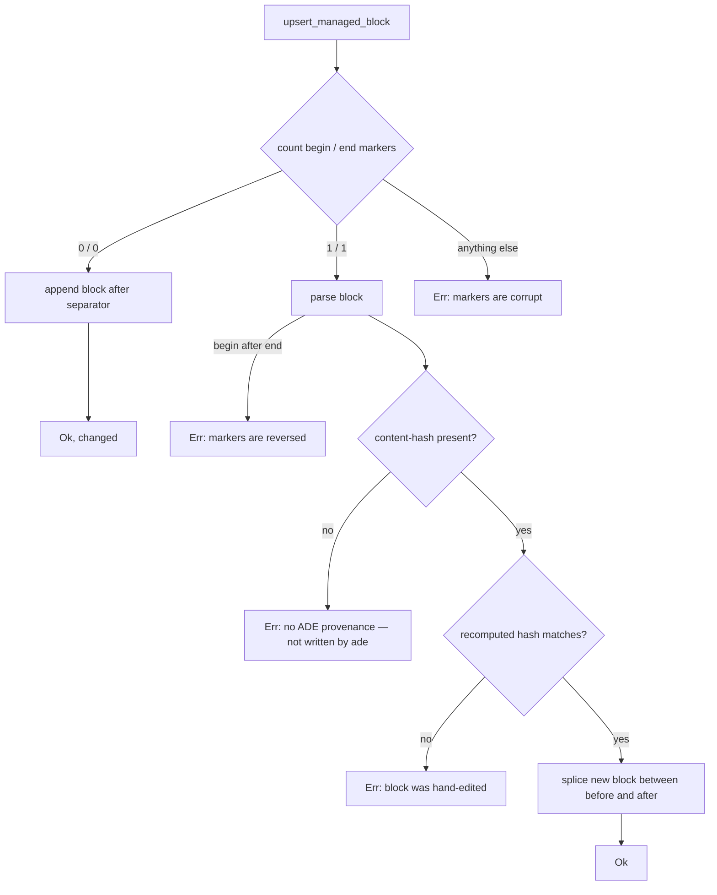

# Instructions and managed blocks

ADE writes into files you also own — `CLAUDE.md`, `AGENTS.md`,
`.cursor/rules/ade.mdc`. The mechanism that makes this safe is a marked region plus a
content hash, and a strict rule: **refuse rather than clobber**.

## Ownership is a content claim, not a path claim

ADE owns the region between `<!-- ade:begin -->` and `<!-- ade:end -->`, and proves it
with a provenance comment carrying `content-hash:<sha256 of the trimmed body>`. Owning
a *path* would mean the whole file is ADE's; owning a *hash* means ADE only ever
rewrites bytes it can prove it wrote.

The body is trim-end normalized before both hashing and rendering, so trailing
whitespace can never change the hash.

## Four outcomes, selected by counting

`upsert_managed_block` decides by marker arithmetic rather than by parsing. Zero begin
and zero end markers means append. Exactly one of each means parse and replace.
Anything else is refused with `managed markers are corrupt (N begin, M end)`.

Two further refusals are distinct and both matter:

- **Markers present with no `content-hash:` provenance line** are treated as *not
  ours*. Someone else's markers, or a hand-rolled imitation, are never replaced.
- **A body whose recomputed hash differs from the declared one** means a human edited
  inside the block. The write is refused and the remediation points at
  `.ade/instructions.local.md`, which is where your text belongs.

The hash scan requires the 64 hex characters to appear contiguously right after the
marker, so a truncated or interrupted hash reads as "no provenance" and refuses, rather
than silently replacing.

`remove_managed_block` deliberately inherits every one of those refusals. Uninstalling
is not a licence to delete content ADE cannot prove it wrote.

## Generated text and your text

`.ade/instructions.md` is generated: module blocks, in registry order, deterministic.
`.ade/instructions.local.md` is its user-writable counterpart, created once and
appended verbatim into every coding agent's managed block.

`strip_stub` decides whether you have actually written anything by stripping HTML
comments, blank lines, and the exact stub heading. An untouched stub, an empty file,
and an absent file are all equivalent to "no user content". The comment stripper is a
hand-written port of the oracle's lazy regex, with one deliberate behavior: an
**unterminated** `<!--` is left in place rather than swallowing the rest of the file.

## Translation

Targets are deduplicated **by path**, which is why the five coding agents that share
`AGENTS.md` collapse into a single write, and targets are sorted for determinism. Only
Cursor gets a frontmatter prefix, and only when the file does not yet exist.

A target that exists but is not a regular file — a symlink, FIFO or socket — is refused
before any read. The stated threat is clobbering an intentional secret mount. Refusals
are **per file**: one poisoned `CLAUDE.md` does not stop `AGENTS.md` from being
written, and the refused file is left byte-identical.

Even an unchanged write is pushed through the artifact writer so the path stays in the
generated set for [lockfile](lockfile-and-verify.md) coverage.

Drift detection compares the extracted block against a freshly rendered one by **byte
equality**, and distinguishes a missing file from a missing or corrupt block from a
merely stale one.

## What is not guaranteed

Exact whitespace round-trip. Removal documents that the append-time separator cannot be
recovered from the final text, so a file that had no trailing newline before ADE
touched it gains one. Only whitespace is ever affected; no user byte is dropped.

## Source map and tests

`crates/ade-core/src/{managed,instructions,translate}.rs`. Focused tests, all in-file:
`hand_edit_inside_block_is_refused`,
`markers_without_provenance_are_not_ours_and_are_refused`,
`corrupt_and_reversed_markers_are_refused`,
`replace_intact_block_preserves_user_content_and_is_idempotent`,
`byte_parity_with_the_ts_oracle`, and in `translate.rs` the per-file refusal and
`non_regular_file_target_is_refused_and_left_untouched`.
