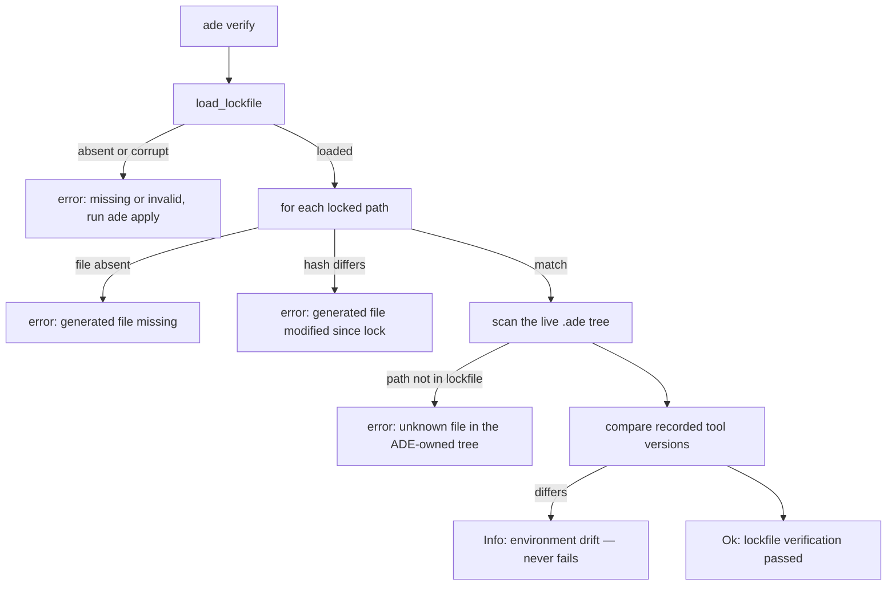

# The lockfile and what verify actually checks

`ade.lock.json` is content-addressed and **timestamp-free by construction**, so
identical inputs produce identical bytes. That is what makes it committable and
diffable, and it is the property [determinism and I/O](determinism-and-io.md) exists to
protect.

It carries five things: a schema version, the ADE version, a path-to-sha256 map, the
audit checkpoint, and an environment record of os, arch and tool versions, plus a
sorted list of configured coding agents.

## Scope is path-derived, not authorship-derived

This is the single most surprising fact about the lockfile, and the one most likely to
bite someone adding a module.

`scan_ade_tree` — **not** the modules' reported written paths — defines what gets
hashed: everything under `.ade/` recursively, minus anything under `.ade/audit/`,
sorted. The audit log is excluded deliberately, because it grows after apply whenever a
coding-agent hook fires; it is pinned by [checkpoint](audit-chain.md) instead.

The consequence is that files ADE writes **outside** `.ade/` receive no hash coverage at
all: `CLAUDE.md`, `AGENTS.md`, `.claude/settings.json`, `.mcp.json`, `.gitignore`,
`.pre-commit-config.yaml`, the git pre-commit hook, and `ade.json` itself. Those are
protected by other mechanisms — the managed-block content hash, and each module's own
`verify` — but not by the lockfile.

The extension trap follows directly: `ModuleResult::wrote_paths` is populated by every
module but is never read outside module code. **A new module that writes outside
`.ade/` silently gets zero lockfile protection.** If you are adding one, that is the
thing to know before you ship it.

## Verify runs in two directions

Every locked path must exist and still hash-match; missing and modified are separate
errors, each naming the file. Then every file found by scanning the live tree must be
known to the lockfile. That second direction is the interesting one, and the code says
why: a rule file dropped into `.ade/guardrails/` is **binding on the coding agent** but
was never written by ADE. The unknown-file rule is how a planted policy gets caught.

Environment drift is informational and **never** fails verify. Only content tampering
flips the verdict. A machine that simply lacks a tool, or has a newer version of one, is
not a failing repository.

An absent lockfile and a corrupt one are treated identically, as
`ade.lock.json missing or invalid` with the remediation ``run `ade apply` ``.

`ade lock` re-derives the same scan and checkpoint and rewrites the file. It is the
sanctioned "adopt current reality" escape hatch named in the verify remediation, and it
is the correct response when you have deliberately changed something ADE generated.

## Edge behavior worth knowing

A scan failure — an absent `.ade/`, an unreadable subtree — yields an **empty listing**
rather than an error, matching the oracle. A permission problem therefore degrades to
"nothing locked", not to a loud failure. Similarly, lockfile generation skips paths it
cannot read, so a race that deletes a file between scan and hash produces a smaller
lockfile rather than an error.

One documented tension: `.ade/instructions.local.md` is described in the code as
user-owned and "never hash-locked", but it lives under `.ade/` and is not excluded by
the scan, so it **is** recorded with a content hash. Editing it and running `ade verify`
without re-applying reports it as a *generated* file modified since lock. Reproduced
live against this repository.

## Source map and tests

`crates/ade-core/src/lockfile.rs`. Focused tests, all in-file:
`records_file_hashes_environment_tools_and_ade_version`,
`serialization_is_byte_deterministic_and_timestamp_free`,
`modified_generated_file_fails_verify_naming_the_file`,
`deleted_generated_file_fails_verify_naming_the_file`,
`tool_version_drift_is_informational_never_a_failure`,
`load_lockfile_absent_and_corrupt_both_return_none`, plus
`lockfile_scope_keeps_ade_artifacts_drops_audit_log_and_user_files` in `run.rs` and
`verify_passes_clean_and_fails_naming_the_tampered_file` in `crates/ade/tests/cli.rs`.
