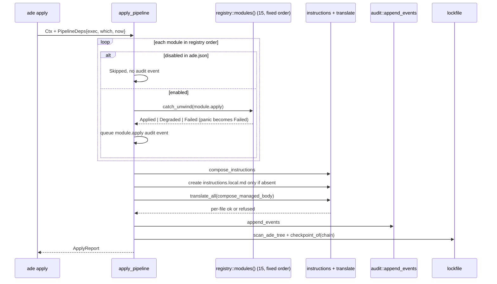

# The apply pipeline

`crates/ade-core/src/run.rs` is the orchestrator. Every command the CLI exposes that
does real work — `init`, `plan`, `apply`, `verify` — resolves to one of four functions
here, and all four share the same shape: build a `Ctx`, walk the module registry in a
fixed order, then run the core-owned steps that no module contributes to.

## Module ordering is a hand-maintained list

`registry::modules()` returns a literal vector of the fifteen modules. There is no
dynamic plugin loading and no discovery pass; the list is maintained by hand, which is
a deliberate reduction of supply-chain surface. That same vector order is also the
order in which each module's `InstructionBlock`s are composed into
`.ade/instructions.md`, so changing the registry changes generated instruction text.

## A panicking module cannot take down the run

Every `module.apply` and `module.verify` call is wrapped in `catch_unwind`. A panic is
caught, stringified through `panic_text`, and converted into a `Failed` `ModuleResult`;
the loop continues to the next module. This is the pipeline's central resilience
property: one broken module degrades its own row in the report rather than aborting a
bootstrap that has already written files.

A module disabled in `ade.json` takes a different path entirely. It is reported as
`Skipped` with the finding `disabled in ade.json`, and it produces **no audit event**,
because the audit push happens inside the enabled branch. At verify time disabled
modules are omitted from `report.modules` altogether, so a consumer sees fourteen rows
rather than fifteen — a reporting shape worth handling.

## The core-owned tail

After the module loop, five steps run unconditionally and cannot be switched off
through configuration:

1. `collect_blocks` + `compose_instructions` render `.ade/instructions.md`.
2. `.ade/instructions.local.md` is created **only if absent** — it is the user's file.
3. `compose_managed_body` splices generated text with the user's local text, and
   `translate_all` upserts that body into each configured instruction file.
4. Audit events for every module, every translation, and the lockfile write are
   appended to the hash chain.
5. `scan_ade_tree` enumerates `.ade/` and `generate_lockfile` writes `ade.lock.json`.

The order of steps 4 and 5 matters: the audit checkpoint embedded in the lockfile is
computed **after** the run's own events are appended, so the lockfile always commits to
a chain that includes the run that wrote it.

`plan_pipeline` mirrors this without writing anything. It calls each module's `plan()`
and then hardcodes those same core-owned actions, which is why `ade plan` can describe
behavior no module is able to contribute to.

## What `ok` does not prove

`ApplyReport.ok` is derived only from module statuses and translation results. The
instructions write, the local-stub write, the audit append and the lockfile write all
discard their errors. An `ok: true` apply therefore does **not** prove `ade.lock.json`
was written. If you are diagnosing a repository whose verify fails immediately after a
green apply, this asymmetry is the first thing to check.

A translation refusal behaves differently and is deliberately loud: a refused target,
such as a symlinked `CLAUDE.md`, is recorded verbatim in the tamper-evident log as
`refused: <error>` and fails the whole apply.

## Verification is a conjunction

`verify_pipeline` combines four independent verdicts: the lockfile check, the audit
chain check, translation-drift detection, and each enabled module's own `verify`. A
missing lockfile or a missing audit log is a hard error carrying the remediation
``run `ade apply` ``. See [lockfile and verify](lockfile-and-verify.md) for what the
first of those actually compares, and [the audit chain](audit-chain.md) for why the
checkpoint lives outside the log it protects.

## A documented contradiction

The comment beside the local-instructions write states that
`.ade/instructions.local.md` is "never hash-locked". The code disagrees: `walk_ade`
excludes only `.ade/audit/`, so the user-owned file **is** hashed into the lockfile.
The observable consequence is that editing your own project instructions and then
running `ade verify` fails with `generated file modified since lock:
.ade/instructions.local.md` — calling a user-owned file "generated" — until the next
`ade apply` or `ade lock`. Reproduced live against this repository. See
[generated artifacts](generated-artifacts.md) for the ownership classes this cuts across.

## Source map and tests

Orchestration lives in `crates/ade-core/src/run.rs`; the registry in
`crates/ade-core/src/registry.rs`. Focused tests, all in-file:
`apply_composes_instructions_translates_locks_and_audits`,
`double_apply_is_byte_stable_while_audit_checkpoint_advances`,
`disabled_module_is_skipped_by_apply_and_writes_nothing`,
`apply_reports_translate_refusal_on_symlinked_instruction_file`,
`panic_containment_holds_across_the_real_registry`, and
`fifteen_modules_in_canonical_order` in `registry.rs`. End to end,
`init_bootstraps_with_pure_json_stdout_and_second_apply_succeeds` in
`crates/ade/tests/cli.rs`.
