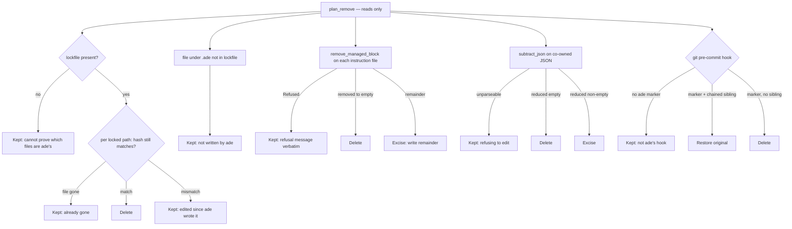

# Withdrawing ADE from a repository

`ade remove` is the inverse of apply, and it is governed by one rule stated in the
module header: **never destroy what we cannot prove we wrote.** A hand-edited ADE file,
a block with no ADE provenance line, a file planted under `.ade/` — each is kept and
reported, never deleted.

This page has no TypeScript counterpart. `ade remove` exists only in Rust; `src/remove.ts`
does not exist in the [v0.1 oracle](../verification/dual-implementation-and-parity.md),
so removal sits outside parity entirely and is verified only by its own Rust tests.

## Removal is lockfile-driven

Each locked path is deleted only when its current hash still equals the recorded one. A
mismatch becomes a kept file explained as *edited since ade wrote it*.

With **no lockfile, nothing under `.ade/` is deleted at all**. A single kept action
explains why: without it, ADE cannot prove which files are its own. Anything present
under `.ade/` but absent from the lockfile is the planted-artifact case and is likewise
kept.

## Plan and execute are the same pass

`plan_remove` computes a mutation per path with zero writes, and the executing call
either replays those mutations or returns them untouched. The real run is the dry run
plus execution, never a second, differently-informed pass over a tree that has already
changed underneath it. That is why `ade remove` without `--yes` is a trustworthy
preview rather than an approximation.

## How each class is withdrawn

- **`.ade/instructions.local.md`** is deleted only when byte-identical to the untouched
  stub. Otherwise it is yours: ADE created the file, but the words are not its own.
- **Managed blocks** go through the same refusal path as
  [upsert](instructions-and-managed-blocks.md). A file whose block was its entire
  content is deleted; a file with surrounding user content is excised in place.
- **Co-owned JSON** is withdrawn by *subtraction*, not by rewriting. The subtraction
  patch is rebuilt from the very constants the modules merge, which is what makes the
  round-trip test a real guard against a module starting to merge something removal
  does not know about. Invalid JSON is kept, not parsed and rewritten.
- **`.gitignore`** loses its labelled header and only the owned lines directly beneath
  it, stopping at the first line ADE does not own, so a user line inside the block
  survives.
- **The git pre-commit hook is restored, not merely deleted.** When ADE's marker is
  present and a chained-aside sibling exists, the original is renamed back. Deleting
  ADE's and leaving the sibling orphaned would silently disable your own hook, which is
  worse than never having installed. A hook with no ADE marker is left alone.
- **`.pre-commit-config.yaml`** is deleted only when it is byte-for-byte what ADE would
  write. The moment it differs, it is yours.

Directory cleanup is bottom-up over exactly three roots and is **never recursive**: one
kept file keeps its whole directory chain alive.

## What is not guaranteed

Mutations are best-effort. A failed delete does not abort the withdrawal, and the report
still claims the planned outcome — so a read-only hook can be reported as excised while
remaining on disk.

Removal also does not cover files ADE wrote outside `.ade/` that are absent from both
the lockfile and the explicit handling list. Only the enumerated cases are withdrawn.

Finally, the `.gitignore` block header is matched by trimmed equality, so a user who
reindented or reworded that comment leaves the block unrecognized and therefore
untouched.

## Source map and tests

`crates/ade-core/src/remove.rs` and `crates/ade-core/src/gui/projects.rs`. The decision
logic lives in `ade-core` rather than the desktop crate on the stated ground that UI
crates are render loops excluded from the coverage gate, so anything that can be got
wrong must sit where it is tested. Focused tests:
`strip_ensure_lines_block_removes_only_owned_lines`,
`managed_block_removal_refuses_what_it_cannot_prove_it_wrote`,
`block_only_file_removes_to_empty_so_the_file_can_go`, and in `run.rs` the full
round trips `remove_restores_the_repo_to_its_pre_init_state`,
`remove_restores_a_git_hook_that_apply_chained_aside`, and
`remove_keeps_hand_edited_planted_and_user_authored_files`.
