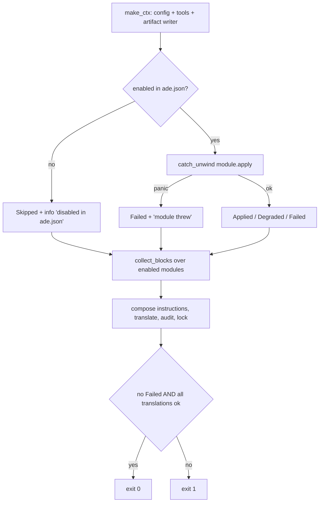

# The module contract

A module is a `'static` singleton behind a trait object, not an instantiable plugin.
Every module file declares one static value and the registry hands out references from a
hardcoded vector. There is deliberately no dynamic loading — the header names
supply-chain surface as the reason. Adding a module means editing two files, and nothing
discovers modules by convention.

## Registry order is load-bearing twice

It is the apply order **and** the instruction-composition order. Reordering the registry
silently rewrites `.ade/instructions.md` byte for byte and therefore breaks the lockfile
hash. If you reorder, expect a verify failure until the next apply.

## The four methods

- **`detect`** is a read-only environment probe returning findings.
- **`plan`** declares intended actions and must touch no disk. Every module carries a
  test asserting the target files do not exist afterwards.
- **`apply`** is the only mutating method, returning a four-state status.
- **`verify`** re-reads from disk and returns a boolean verdict.

**`detect` is currently dead in every shipping code path.** A search for its call sites
finds only test modules. Neither the plan, apply nor verify pipelines invoke it, and
`ade doctor` uses separate helpers. It is an extension seam kept warm by unit tests, not
a runtime stage. Worth knowing before you put an environment probe there and expect it
to run.

## Degraded is a success

Apply's overall verdict is *no module failed and every translation succeeded*. A module
that wrote its artifact but found its enforcing tool absent returns `Degraded`, and
`ade apply` still exits zero. Only `Failed` — an option-validation error, an I/O error,
or a caught panic — fails the run.

The `Finding` severity ladder is ordered, but verify failure is driven by each module's
own boolean rather than by the ladder. The one place a level directly gates a verdict is
the core translation step, where any error-level finding fails it.

## Instruction blocks

A block carries no heading of its own; the composer renders `### {title}` plus the
trimmed body, joined by blank lines under a fixed generated-file header. Byte parity
with the TypeScript oracle is pinned by a hash constant in the source.

## Integrate, never force-install

This is written convention with an enforced shape. The spec's implementation bias says
integrate before rebuilding; the repository convention states that modules detect and
wire tools and that `ade apply` must never force-install anything. The mechanism is a
shared helper that turns an absent tool into a degraded finding carrying install
guidance as its remediation — never a subprocess install.

Note the honest limit: every module receives injected exec and which closures, so a
module *could* shell out. The guarantee is convention plus the fact that none does.

## Two traps worth knowing before you add a module

**Reported written paths are advisory only.** The field's own comment says it feeds the
lockfile. It does not: the lockfile is built from a filesystem walk of the ADE-owned
tree. A module writing outside that tree gets no hash coverage, and drift there is
caught only by its own `verify`.

**Option validation is per-module and opt-in.** Options are untyped JSON fetched by id,
returning an empty object when unconfigured. Some modules ship validators and fail
closed before writing; others have none.

Each module's `spec()` string is a one-to-one traceability link to the fifteen core
components enumerated in the tracked `ADE Bootstrapper.md`, and the registry test asserts
none is empty.

## Source map and tests

`crates/ade-core/src/modules/{mod,shared}.rs`, `crates/ade-core/src/types.rs`,
`crates/ade-core/src/registry.rs`, and the tracked spec `ADE Bootstrapper.md`. Focused
tests: `fifteen_modules_in_canonical_order`,
`composition_includes_header_edit_guidance_and_enabled_module_blocks_in_order`,
`byte_parity_with_the_ts_oracle`, `policy_write_read_and_verify_round_trip`, and
`tool_finding_matches_oracle_strings`.
